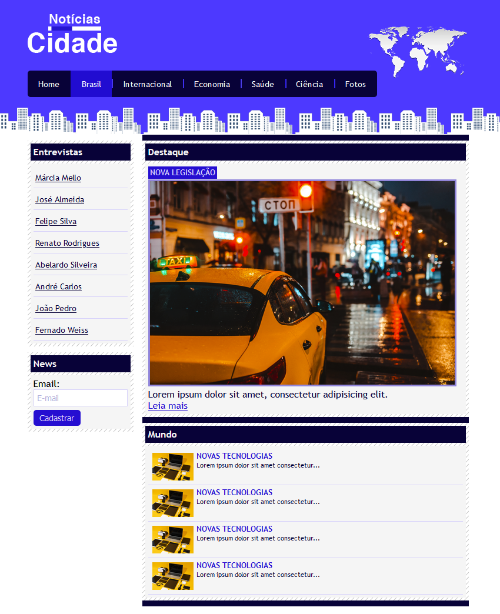
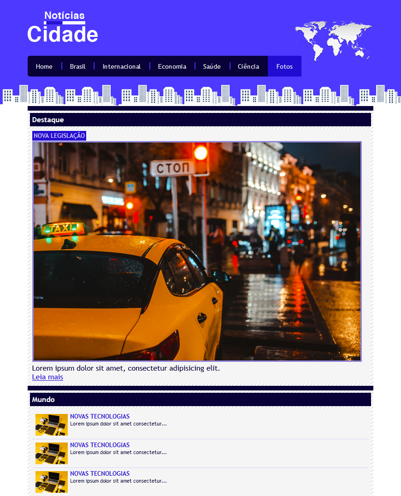

# Projeto Inicial

### Página três colunas

  

### Página duas colunas

  

### Página uma coluna

  

Este projeto de um site de notícias é uma implementação inicial criada em colaboração com o professor Jorge Sant Ana. Foi desenvolvido como parte do curso **Domine Web - 20 Cursos - HTML5, CSS3, SASS, Bootstrap, JS, ES6, PHP, OO, MySQL, JQuery, MVC, APIs, IONIC e muito mais** disponível na [Udemy](https://www.udemy.com/course/web-completo/).

## Descrição

O objetivo deste projeto é fornecer uma base sólida para o desenvolvimento web, abrangendo diversas tecnologias e práticas recomendadas. Ele serve como ponto de partida para desenvolvedores que desejam dominar o desenvolvimento web completo, desde a criação de layouts responsivos até a implementação de sistemas backend robustos.

## Tecnologias Utilizadas

- **HTML5**: Linguagem de marcação para estruturação de conteúdo web.
- **CSS3**: Folhas de estilo para estilização e design.